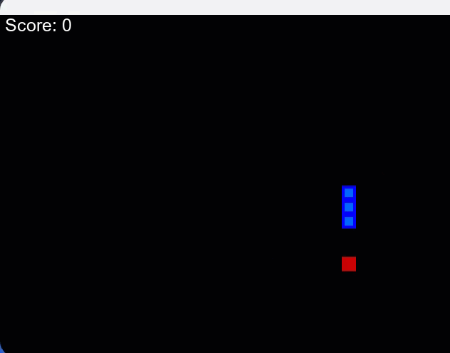
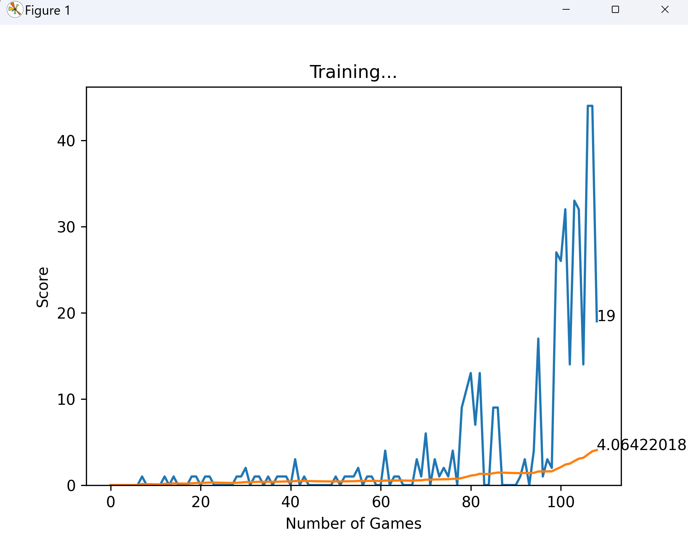

# Teach AI To Play Snake! Reinforcement Learning With PyTorch and Pygame

This is SnakeAI built with Python + PyTorch + Pygame + Reinforcement Learning.  




## Usage


Install the dependencies

```bash
pipenv install -r requirements.txt 
```

Run server

```bash
python agent.py
```

Play the snake game manually:

Run server

```bash
python snake_game_human.py
```
